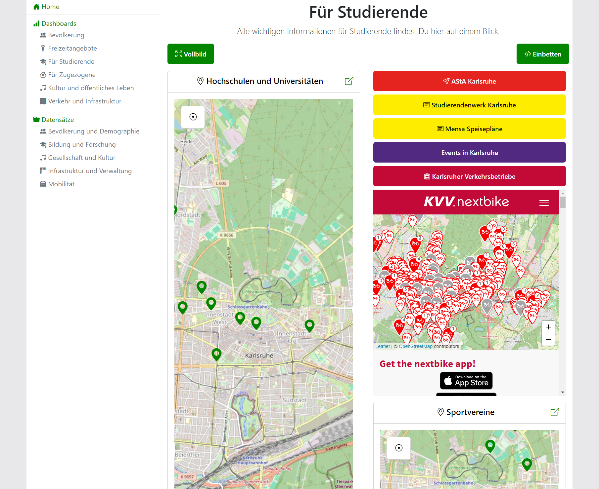

# Dashboards

Dashboards are used to display multiple resources related to a single topic on one page. There is a number of available dashboard contents to choose from:

* Resource: Display a resource visualization available in the application, as described in [visualizations](visualizations.md).
* External Content: Display content that is otherwise not available in the application.
* Links: Display links to internal or external content.
* Text: Display text standalone or in a carousel view.

**Configuration:** For configuration reference, refer to [dashboard configuration](../configuration/dashboards.md).

<figure markdown="span">
    { loading=lazy }
</figure>
