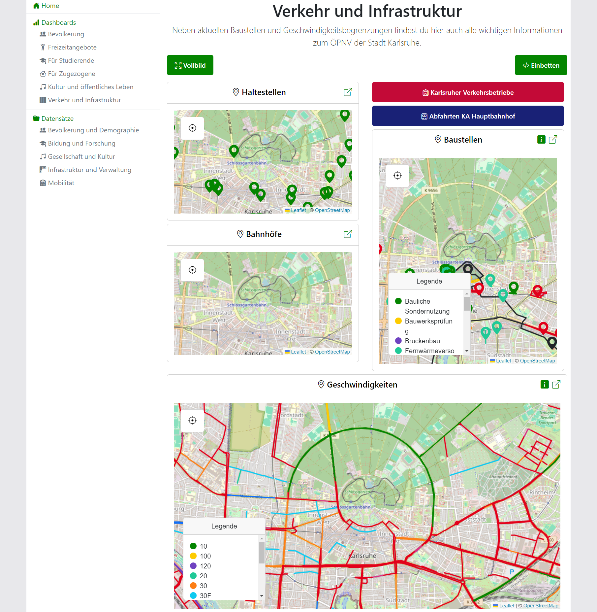

# About

## Features

To visualize an organize open data, the `Open Data Dashboard` provides a number of main features:

* [Visualizations](visualizations.md): Single dataset visualizations are the backbone of the `Open Data Dashboard`.
* Categories: Categories and subcategories are used to organize the data available in the application
and to allow an easy navigation between different datasets.
* [Dashboards](dashboards.md): Dashboards combine multiple dataset visualizations together with other contents on a single page.
* Search: Using the search, every content available in the application can be found quickly.

## Technical Documentation

The [technical documentation](technical-documentation.md) provides an overview of the `Open Data Dashboards`'s inner workings.

<figure markdown="span">
    { loading=lazy }
</figure>
