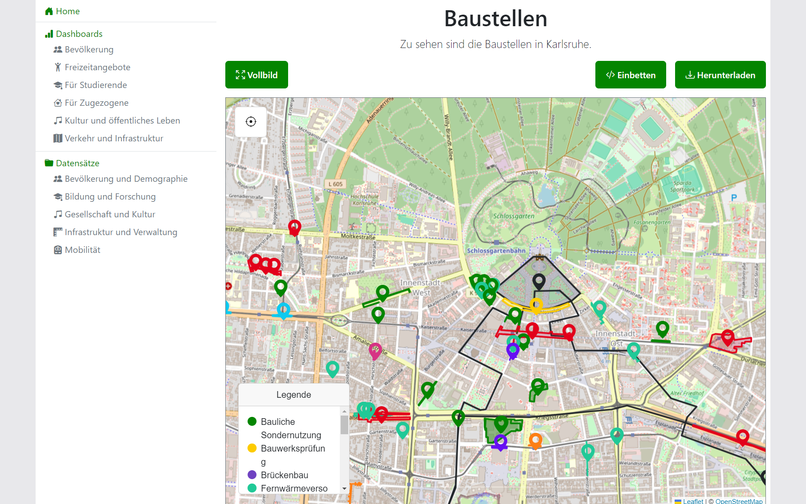

# Visualizations

Visualizing data is the main purpose of the application. Data can be displayed in a number of different ways:

* [Map](#map)
* [Bar Chart](#bar-chart)
* [Table](#table)
* [Embedded](#embedded)

Each visualization can be easily embedded into other webpages using the `Embed` button.

## Map

[GeoJSON](../configuration/data-types.md#geojson) data can be visualized as a map. Most common GeoJSON geometries are supported.

<figure markdown="span">
    { loading=lazy }
</figure>
<figure markdown="span">
    { loading=lazy }
</figure>

**Features:**

* Grouping of data with each group being given a color
* Additional information on hover
* Reset view

**Configuration**: For configuration reference, see [map configuration](../configuration/visualizations.md#map).

## Bar Chart

[CSV](../configuration/data-types.md#csv) and [JSON](../configuration/data-types.md#json) data can be visualized as a horizontal or vertical bar chart.

<figure markdown="span">
    { loading=lazy }
</figure>
<figure markdown="span">
    { loading=lazy }
</figure>

**Features:**

* [Filters](#filters)
* Additional information on hover
* Dynamically select and deselect x- and y-axes

**Configuration**: For configuration reference, see [bar chart configuration](../configuration/visualizations.md#bar-chart).

## Table

[CSV](../configuration/data-types.md#csv) and [JSON](../configuration/data-types.md#json) data can be visualized as a table.

<figure markdown="span">
    { loading=lazy }
</figure>

**Features:**

* [Filters](#filters)
* Sorting
* Pagination
* Rearrangeable columns

**Configuration**: For configuration reference, see [table configuration](../configuration/visualizations.en.md#table).

## Embedded

[HTML and PDF](../configuration/data-types.md#html-and-pdf) data can be embedded into the application.

<figure markdown="span">
    { loading=lazy }
</figure>

## Filters

Data displayed in [Bar Chart](#bar-chart) and [Table](#table) visualizations can be filtered in real-time.

<figure markdown="span">
    { loading=lazy }
</figure>

**Features:**

* Partial string matching across all properties (ignores case)
* Min-/Max-Boundaries for numeric properties
* Partial string matching for non-numeric properties (ignores case)
* Distinct URL for each filter setting for easier sharing and revisiting of views
