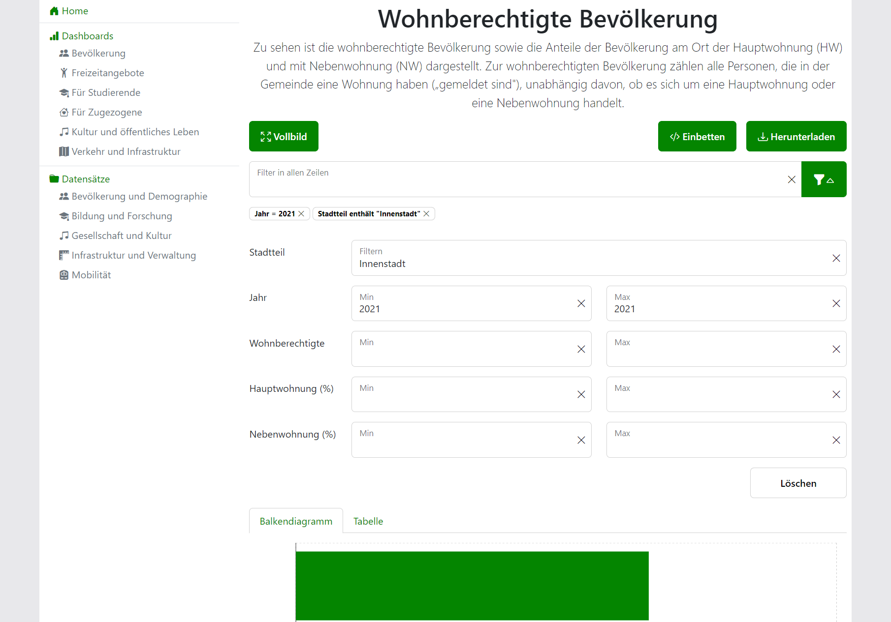

# Real-Time Filters

!!! note
    This feature is only available for [Bar Chart](visualizations.md#bar-chart) and [Table](visualizations.md#table) visualizations.

`Open Data Dashboard` allows filtering of the visualized data. Upon changing the value of a filter, the displayed data will update instantaneously.

<figure markdown="span">
    { loading=lazy }
    <figcaption>Real-Time Filters</figcaption>
</figure>

## Features

<!-- TODO: Update features after refactoring in https://h-ka-team-rdqzrlfpomci.atlassian.net/browse/ODDSK-148 -->
- Partial string matching across all columns (ignores case)
- Min-/Max-Boundaries for numeric columns
- Partial string matching for non-numeric columns (ignores case)
- [Integration with URL Parameters](#integration-with-url-parameters)

## Integration with URL Parameters

The filter component is integrated with query parameters in the URL.
This means that each unique combination of filter settings generates a distinct URL, allowing users to easily share and revisit specific views.

Filter settings are saved in the query parameter `search`. Upon adjusting a filter setting, the value of `search` will get updated.

Assuming the following filters ...

````text linenums="1"
StringColumn contains "Seal"
IntegerColumn ≥ 20
````

... the query (an URL-encoded JSON object) will be `search=%7B"StringColumn"%3A"Seal"%2C"IntegerColumn-min"%3A"20"%7D`.
