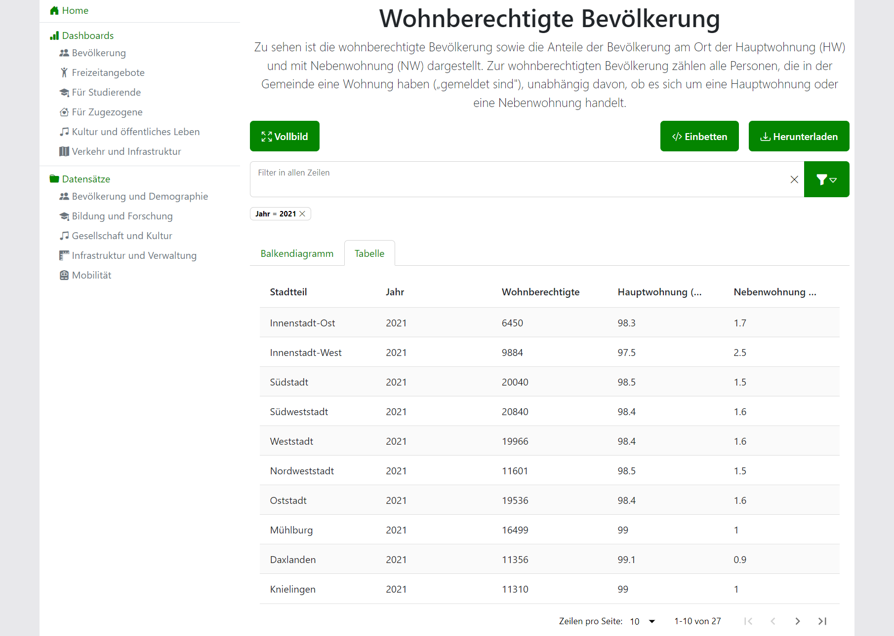

# Visualizations

## Bar Chart

[CSV](dataTypes.en.md#csv) and [JSON](dataTypes.en.md#json) data can be visualized as a bar chart.

## Table

[CSV](dataTypes.en.md#csv) and [JSON](dataTypes.en.md#json) data can be visualized as a table.

## Map

[GeoJSON](dataTypes.en.md#geojson) data can be visualized as a map.

## Embedded Viewer

[HTML and PDF](dataTypes.en.md#html-and-pdf) data can be embedded into the application.
