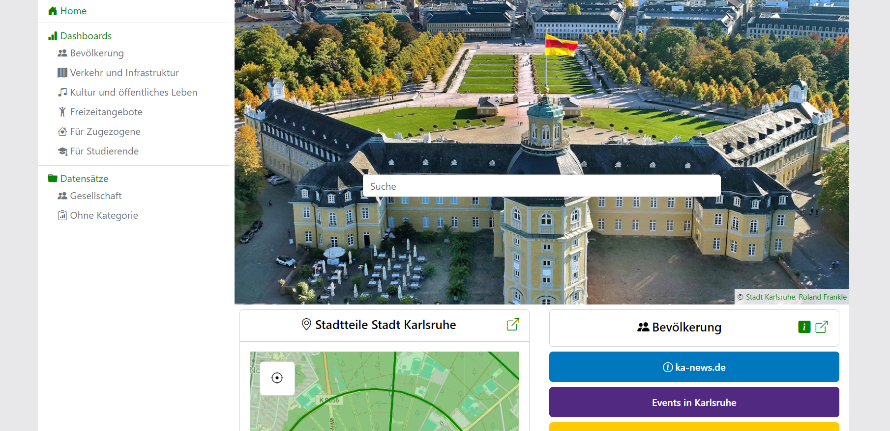

<h1 align="center">Welcome to the Open Data Dashboard</h1>
<h3 align="center">A web application for visualizing open data</h3>

<figure markdown="span">
    { loading=lazy }
</figure>

## Getting Started

The easiest way to get started is checking out the [Open Data Dashboard Karlsruhe](https://open-data-dashboard.netlify.app/).
For further reading, consider the following resources:

* [About](about/index.md): Get familiar with the features and the architecture of the Open Data Dashboard.
* [Configuration](configuration/index.md): Find out how to configure data to be displayed within the Open Data Dashboard.
* [Development](development/index.md): Here, you can find some basic starting points for working on the source code
and the documentation of the Open Data Dashboard.
* [Continuous Integration](ci-cd/continuous-integration.md) and [Continuous Delivery](ci-cd/continuos-delivery.md):
An introduction to the continuous integration, testing and continuous delivery tools used for the Open Data Dashboard.
